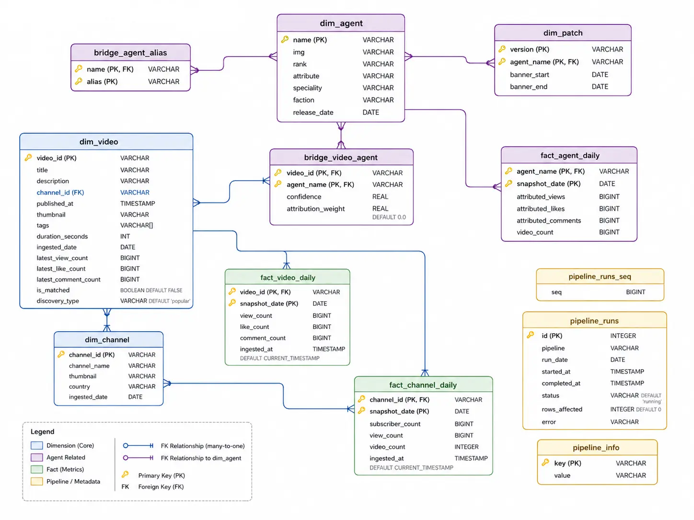

# ZZZ YouTube Analytics

Data engineering pipeline that tracks **Zenless Zone Zero** character popularity on YouTube — ingests video/channel data, fuzzy-matches agents, and produces time-series analytics in DuckDB.

Dashboard: [zzz-yt-trends.vercel.app](https://zzz-yt-trends.vercel.app)

### Docs

| Topic | Link |
|---|---|
| Setup & Run | [readme/setup.md](readme/setup.md) |
| Ingestion: Backfill & Daily | [readme/ingestion.md](readme/ingestion.md) |
| Agent & Banner Sources | [readme/scraping.md](readme/scraping.md) |
| Agent ↔ Video Matching | [readme/matching.md](readme/matching.md) |
| Enrichment & Daily Facts | [readme/enrichment.md](readme/enrichment.md) |

